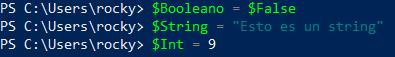
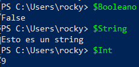
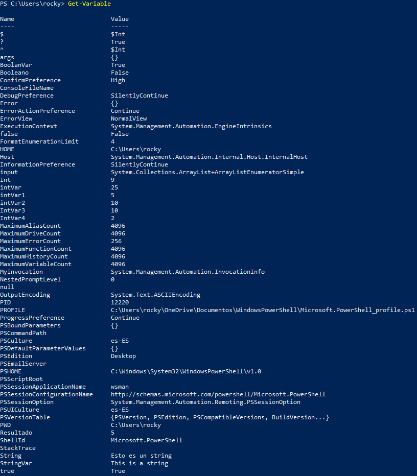
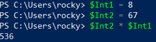
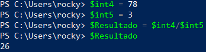
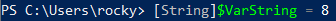
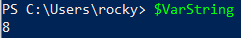

# Variable and Comparison Operators
## Task 1
### Assign a variable with each datatypes covered in the previous workshop
Ejecutamos:

Comprobamos los valores:

## Task 2 
### List all variables currently loaded in to memory.
Ejecutamos:

## Task 3 
### Multiple two Int variables together
Ejecutamos:

## Task 4
###  First declare two Int variables. Then divided the first variable by the second and assign the result to a variable named $VariableResult
Ejecutamos:

## Task 5 
### Typecast a Variable as a “String” and assign it a value of 5
Ejecutamos:

Y comprobamos:

